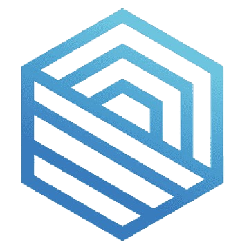

<a name="readme-top">

<br/>

<br />
<div align="center">
  <a href="https://github.com/xtianjms/">
  <!-- TODO: If you want to add logo or banner you can add it here -->
    
  </a>
<!-- TODO: Change Title to the name of the title of your Project -->
  <h3 align="center">Hero Section Gallery</h3>
</div>
<!-- TODO: Make a short description -->
<div align="center">

</div>

<br />

<!-- TODO: Change the zyx-0314 into your github username  -->
<!-- TODO: Change the WD-Template-Project into the same name of your folder -->


---

<br />
<br />

<!-- TODO: If you want to add more layers for your readme -->
<details>
  <summary>Table of Contents</summary>
  <ol>
    <li>
      <a href="#overview">Overview</a>
      <ol>
        <li>
          <a href="#key-components">Key Components</a>
        </li>
        <li>
          <a href="#technology">Technology</a>
        </li>
      </ol>
    </li>
    <li>
      <a href="#rule,-practices-and-principles">Rules, Practices and Principles</a>
    </li>
    <li>
      <a href="#resources">Resources</a>
    </li>
  </ol>
</details>

---

## Overview

<!-- TODO: To be changed -->
<!-- The following are just sample -->
This project showcases a Features Display Website built using pure HTML and CSS. It includes a landing page and multiple feature pages with distinct and visually appealing layouts.

Guiding Question:
- What is the project
The project is a Features Display Website built using pure HTML and CSS. It includes a landing page and multiple feature pages that showcase different and distinct design layouts.

- Whats the purpose
The purpose of this project is to demonstrate the ability to create visually appealing and functional web pages using basic web technologies.

- What are key components
Landing Page: 
  - Title: Landing Page
  - Subtitle: Seatwork 4
  - Description: My website features a variety of distinct hero layouts, each meticulously crafted with HTML, CSS, and, JavaScript.
  - Navigation: Links to feature pages.

- What technology used and how it is used
HTML:
  - Used to structure the content of the landing page and feature pages.
CSS:
  - External CSS files are used to style the landing page and feature pages, ensuring separation of concerns and maintainable code.

### Key Components
<!-- TODO: List of Key Components -->
<!-- The following are just sample -->
- MultiPage Website/Single Page Website
- Parallax transition
- Transactional

### Technology
<!-- TODO: List of Technology Used -->


## Rules, Practices and Principles
1. Always use `WD-` in the front of the Title of the Project for the Subject followed by your custom naming.
2. Do not rename any .html files; always use `index.html` as the filename.
3. Place Files in their respective folders.
4. All file naming are in camel case.
   - Camel case is naming format where there is no white space in separation of each words, the first word is in all lower case while the succeding words first letter are in upper followed by lower cased letters.
   - ex.: buttonAnimatedStyle.css
5. Use only `External CSS`.
6. Renaming of Pages folder names are a must, and relates to what it is doing or data it holding.
7. File Structure to follow below.

```
WD-ProjectName
└─ assets
|   └─ css
|   |   └─ style.css
|   └─ img
|   |   └─ fileWith.jpeg/.jpg/.webp/.png
|   └─ js
|       └─ script.js
└─ pages
|  └─ pageName
|     └─ assets
|     |  └─ css
|     |  |  └─ style.css
|     |  └─ img
|     |  |  └─ fileWith.jpeg/.jpg/.webp/.png
|     |  └─ js
|     |     └─ script.js
|     └─ index.html
└─ index.html
└─ readme.md
```

## Resources

<!-- TODO: Add References -->
| Title | Purpose | Link |
|-|-|-|
|Google Fonts| Ideas for fonts | https://fonts.google.com |

## Wakatime
<div align="center" float="left">
  <p>
    
    
  </p>
  <p>
    
    
  </p>
  </img>

</div>
